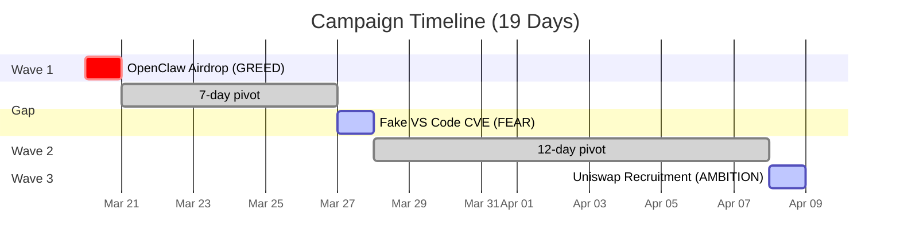
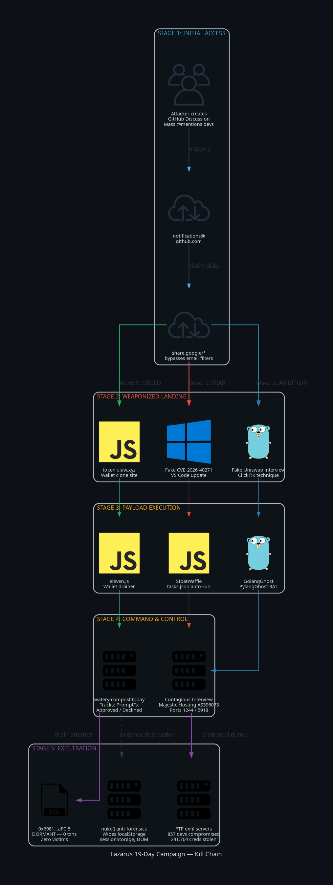
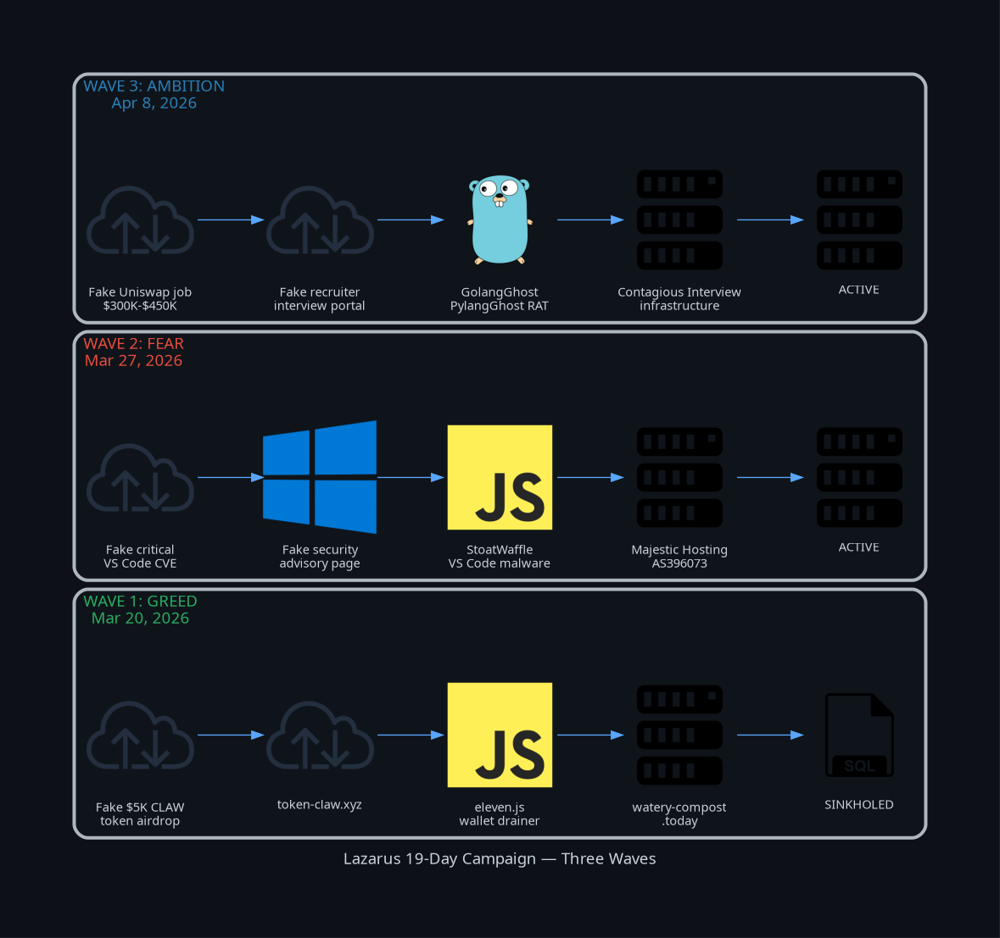
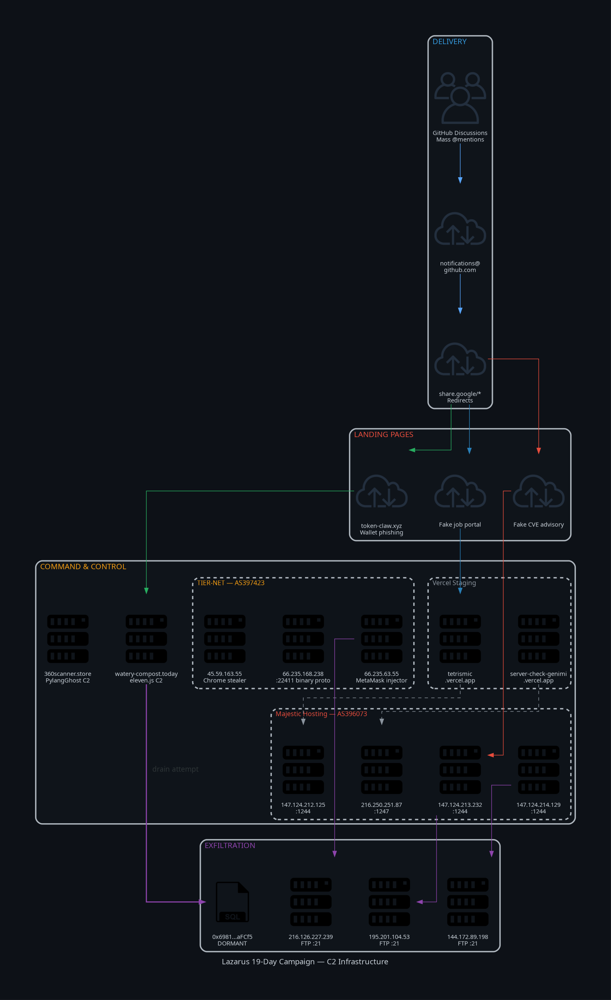
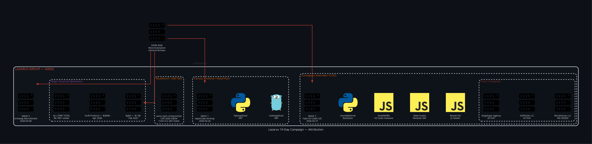
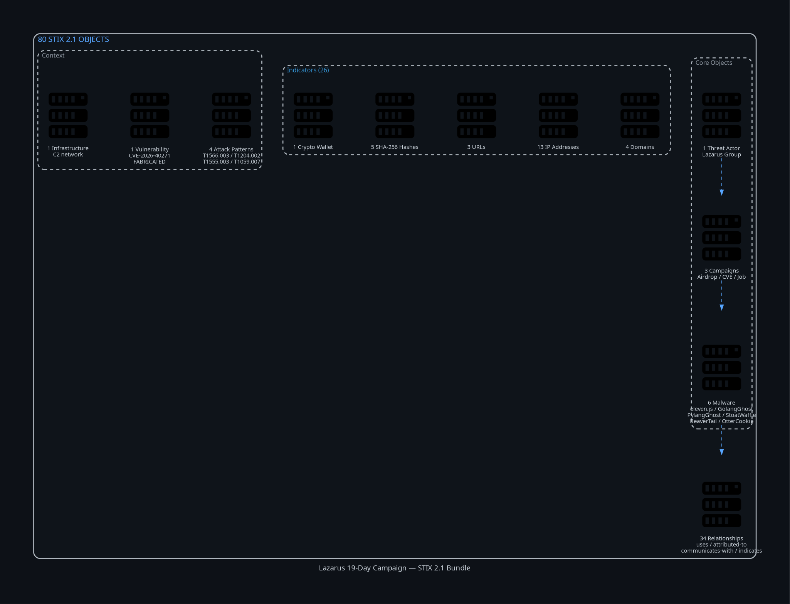

# Lazarus Group: 19-Day A/B Test Campaign Analysis

> **TLP:CLEAR** | Defensive threat intelligence only | No malware, exploits, or PII | [Full disclaimer](DISCLAIMER.md)

Deep-dive threat intelligence package on Lazarus Group's three-wave GitHub phishing campaign targeting developers (March -- April 2026). Built by enriching [@toxy4ny](https://github.com/toxy4ny)'s original research with VulnGraph, GitHub OSINT, blockchain forensics, and live C2 reconnaissance.

---

## Table of Contents

- [Campaign at a Glance](#campaign-at-a-glance)
- [Kill Chain](#kill-chain)
- [Wave Comparison](#wave-comparison)
- [C2 Infrastructure](#c2-infrastructure)
- [Attribution](#attribution)
- [Key Findings](#key-findings)
- [Repository Layout](#repository-layout)
- [Intel Reports](#intel-reports)
- [Detection Engineering](#detection-engineering)
- [Threat Sharing Formats](#threat-sharing-formats)
- [Quick Start](#quick-start)
- [Sources and Tools](#sources-and-tools)
- [Credits](#credits)
- [Disclaimer and License](#disclaimer-and-license)

---

## Campaign at a Glance



Three waves. One target pool. Three psychological triggers. Identical delivery each time: **GitHub notification pipeline abuse** via mass-mention discussions redirected through `share.google/` URLs.

| | Wave 1 | Wave 2 | Wave 3 |
|:--|:--|:--|:--|
| **Date** | Mar 20 | Mar 27 | Apr 8 |
| **Emotion** | Greed | Fear | Ambition |
| **Lure** | $5K CLAW token airdrop | Fake critical CVE | $300K -- $450K job offer |
| **Payload** | eleven.js wallet drainer | Malware dropper | GolangGhost RAT |
| **Status** | Sinkholed | Active | Active |

---

## Kill Chain

<p align="center">
  
</p>

---

## Wave Comparison

<p align="center">
  
</p>

---

## C2 Infrastructure

<p align="center">
  
</p>

---

## Attribution

<p align="center">
  
</p>

---

## Key Findings

| # | Finding | Detail |
|:-:|---------|--------|
| 1 | **Fake CVE confirmed fabricated** | `CVE-2026-40271-64398` absent from VulnGraph (343K CVEs), MITRE, and NVD |
| 2 | **Attacker wallet dormant** | `0x6981E9EA...` has zero transactions ever -- zero victims lost funds |
| 3 | **857 developers compromised** | Across 90 countries via Contagious Interview; 241,764 credentials stolen |
| 4 | **C2 infrastructure still live** | Most domains and IPs operational; operators actively block researchers |
| 5 | **$6.75 B stolen all-time** | Lazarus is the most profitable state-sponsored cybercrime operation in history |
| 6 | **AI tools now targeted** | OtterCookie npm packages impersonating Gemini, Cursor, Claude |
| 7 | **217 real CVEs on OpenClaw** | 11 Critical, 91 High; 42 K+ exposed instances -- high-value impersonation target |
| 8 | **70 % honeypot probability** | Red Asgard assesses some C2 servers may be counter-intelligence traps |

---

## Repository Layout

```
vajra-sec-experiment/
│
├── README.md
├── LICENSE                                       MIT
├── DISCLAIMER.md                                 Legal, attribution caveats, responsible use
│
├── diagrams/                                     Generated architecture diagrams
│   ├── generate_all.py                           Python diagrams-as-code source
│   ├── 01_kill_chain.png                         Six-stage attack flow
│   ├── 02_c2_infrastructure.png                  Full C2 topology
│   ├── 03_attribution.png                        DPRK org tree + campaign mapping
│   ├── 04_wave_comparison.png                    Side-by-side wave breakdown
│   └── 05_stix_bundle.png                        STIX object composition
│
├── intel/                                        Intelligence reports
│   ├── dossier.md                                Master campaign analysis
│   ├── strategic-context.md                      DPRK program & $6.75 B context
│   ├── blockchain-forensics.md                   Wallet trace (dormant, 0 victims)
│   ├── c2-infrastructure-status.md               Live recon (857 victims, 241 K creds)
│   └── iocs.json                                 Structured IOCs (machine-readable)
│
├── detection/                                    Detection engineering
│   ├── yara/
│   │   └── lazarus_19day_campaign.yar            9 rules
│   ├── sigma/
│   │   ├── ...notification_phishing.yml          2 rules  (proxy + email)
│   │   └── ...contagious_interview_endpoint.yml  4 rules  (persistence + theft)
│   ├── suricata/
│   │   └── lazarus_network.rules                 23 rules (C2 IPs, ports, protocols)
│   ├── nuclei/
│   │   └── lazarus-c2-infrastructure.yaml        5 scanning templates
│   ├── hunting-queries.md                        Splunk, KQL, EQL, Shodan, Censys, VT
│   └── ioc-blocklist.txt                         Flat blocklist for firewall / DNS / proxy
│
├── sharing/                                      Threat intel exchange
│   ├── attack-navigator/
│   │   └── lazarus-19day-layer.json              72 ATT&CK techniques
│   └── stix/
│       └── lazarus-19day-bundle.json             80 STIX 2.1 objects
│
└── tools/
    └── vajra-skill.md                            Vajra analysis engine reference
```

---

## Intel Reports

| Report | What it covers | Headline number |
|--------|---------------|-----------------|
| [`intel/dossier.md`](intel/dossier.md) | Full campaign analysis, malware teardowns, ATT&CK mapping | 3 waves, 15 techniques |
| [`intel/strategic-context.md`](intel/strategic-context.md) | DPRK cyber program, front companies, campaign genealogy | $6.75 B stolen all-time |
| [`intel/blockchain-forensics.md`](intel/blockchain-forensics.md) | On-chain wallet trace | 0 transactions, 0 victims |
| [`intel/c2-infrastructure-status.md`](intel/c2-infrastructure-status.md) | Live C2 recon, victim impact, new infrastructure | 857 devs, 241 K creds |
| [`intel/iocs.json`](intel/iocs.json) | Machine-readable structured IOC dataset | JSON for SIEM/SOAR |

---

## Detection Engineering

### YARA -- 9 rules

| Rule | Targets |
|------|---------|
| `Lazarus_ElevenJS_WalletDrainer` | C2 domains, wallet address, `nuke()` function, obfuscation patterns |
| `Lazarus_FakeCVE_Lure` | CVE-2026-40271, fake researcher name, urgency language |
| `Lazarus_GoogleShare_Redirect` | All three campaign redirect URLs |
| `Lazarus_PylangGhost_RAT` | 10-command dictionary, function signatures, C2 domain, artifacts |
| `Lazarus_PylangGhost_Hashes` | 5 known SHA-256 file hashes |
| `Lazarus_ContagiousInterview_Workspace_Init` | Telemetry exfil, tracker URLs, VS Code context |
| `Lazarus_BeaverTail_C2_Ports` | Multi-port signature, 6 XOR encryption keys |
| `Lazarus_FakeRecruitment_Lure` | Salary outliers, grammar markers, DeFi challenge patterns |
| `Lazarus_Axios_Supply_Chain` | `plain-crypto-js` trojan, malicious axios versions |

### Sigma -- 6 rules

| Rule | Layer | Detects |
|------|-------|---------|
| GitHub Notification Phishing | Proxy | Google Share redirect URLs, C2 domains |
| Fake CVE Email | Email | CVE-2026-40271, fake researcher attribution |
| VS Code Workspace Init | Endpoint | Malicious `init-workspace` scripts, telemetry exfil |
| PylangGhost Persistence | Registry | `NodeHelper`, `csshost.exe`, `nvidiaRelease` |
| Scheduled Task Persistence | Endpoint | `NodeUpdate`, `Runtime Broker` tasks |
| Wallet Extension Theft | File access | MetaMask / Phantom / Keplr data accessed by non-browsers |

### Suricata / Snort -- 23 rules

All known C2 IPs and ports, FTP exfil servers, domain-based detection, Vercel staging, user-agent signatures, and the custom binary protocol on ports 22411-22412.

### Nuclei -- 5 templates

| Template | Scans for |
|----------|-----------|
| BeaverTail Port Signature | Port 1244 + 5918 co-occurrence |
| Z238 Binary Protocol | Custom binary banner on port 22411 |
| OpenClaw Phishing Site | Cloned sites serving `eleven.js` |
| PylangGhost C2 | `python-requests` user-agent C2 pattern |
| Vercel Stage 1 | Known Vercel staging domains still live |

### Hunting Queries

Pre-built queries for **Splunk SPL**, **Microsoft KQL**, **Elastic EQL**, **Shodan / Censys**, and **VirusTotal**.

---

## Threat Sharing Formats

### ATT&CK Navigator

Import [`sharing/attack-navigator/lazarus-19day-layer.json`](sharing/attack-navigator/lazarus-19day-layer.json) into the [ATT&CK Navigator](https://mitre-attack.github.io/attack-navigator/).

```
72 technique entries  |  33 unique techniques
Red   = 20 observed in this campaign
Orange = 13 broader Lazarus G0032 arsenal
```

### STIX 2.1 Bundle

Import [`sharing/stix/lazarus-19day-bundle.json`](sharing/stix/lazarus-19day-bundle.json) into [MISP](https://www.misp-project.org/) or [OpenCTI](https://www.opencti.io/).

<p align="center">
  
</p>

---

## Quick Start

**Block IOCs immediately**

```bash
grep -v '^#' detection/ioc-blocklist.txt | grep -v '^$'
```

**Scan infrastructure with Nuclei**

```bash
nuclei -t detection/nuclei/lazarus-c2-infrastructure.yaml -l targets.txt
```

**Sweep files with YARA**

```bash
yara detection/yara/lazarus_19day_campaign.yar /path/to/scan
```

**Convert Sigma to your SIEM**

```bash
sigma convert -t splunk              detection/sigma/*.yml
sigma convert -t microsoft365defender detection/sigma/*.yml
```

**Import ATT&CK layer**

1. Open [ATT&CK Navigator](https://mitre-attack.github.io/attack-navigator/)
2. **Open Existing Layer** > **Upload from local**
3. Select `sharing/attack-navigator/lazarus-19day-layer.json`

**Import STIX into OpenCTI**

```python
from pycti import OpenCTIApiClient
api = OpenCTIApiClient("https://your-opencti", "YOUR_TOKEN")
api.stix2.import_bundle_from_file("sharing/stix/lazarus-19day-bundle.json")
```

**Analyze IOCs with Vajra**

```bash
vajra essence intel/iocs.json --profile fraud --format markdown
vajra invariants intel/iocs.json
vajra fingerprint intel/iocs.json
```

---

## Sources and Tools

| Source | What it provided | Freshness |
|--------|-----------------|-----------|
| [VulnGraph](https://vulngraph.tools) | 343 K CVEs, EPSS, KEV, exploits, ATT&CK graph | Live (< 3 h) |
| GitHub API | User profiles, repos, issues, code search | Live |
| Web OSINT | 30+ publications and researcher blogs | Live |
| [MITRE ATT&CK](https://attack.mitre.org/groups/G0032/) | Lazarus G0032: 119 relationships | Quarterly |
| [Red Asgard](https://redasgard.com) | Contagious Interview C2 mapping | Feb 2026 |
| [OX Security](https://www.ox.security) | OpenClaw phishing discovery and eleven.js analysis | Mar 2026 |
| [ANY.RUN](https://any.run) | PylangGhost RAT deep malware analysis | 2026 |
| [Silent Push](https://www.silentpush.com) | Front company identification | Apr 2025 |
| Etherscan | Blockchain wallet forensics | Live |
| [Vajra](tools/vajra-skill.md) | Deterministic structural analysis of IOC data | Local tool |

---

## Credits

This package extends the first-hand research of **[@toxy4ny (KL3FT3Z)](https://github.com/toxy4ny)**, Red Team Lead at [Hackteam.Red](https://hackteam.red), who was personally targeted in all three waves of this campaign.

| Article | Focus |
|---------|-------|
| [19-Day A/B Test (main)](https://dev.to/toxy4ny/lazarus-groups-19-day-ab-test-how-north-korean-apt-pivoted-from-airdrops-to-fake-cves-to-dream-42af) | Three-wave campaign overview |
| [Fake CVE Wave](https://dev.to/toxy4ny/lazarus-group-evolves-from-fake-airdrops-to-fake-cves-new-github-phishing-wave-2bm7) | Wave 2 deep dive |
| [OpenClaw Phishing](https://dev.to/toxy4ny/github-developers-targeted-in-sophisticated-openclaw-phishing-scam-1lei) | Wave 1 deep dive |

---

## Disclaimer and License

This repository is published **exclusively for defensive security purposes**. It contains no malware, exploit code, offensive tooling, or PII. Attribution assessments are analytical judgments, not legal conclusions. IOCs have limited shelf life -- verify before blocking. See [`DISCLAIMER.md`](DISCLAIMER.md) for full terms.

Released under the [MIT License](LICENSE) and **TLP:CLEAR** for unrestricted defensive use and sharing.
